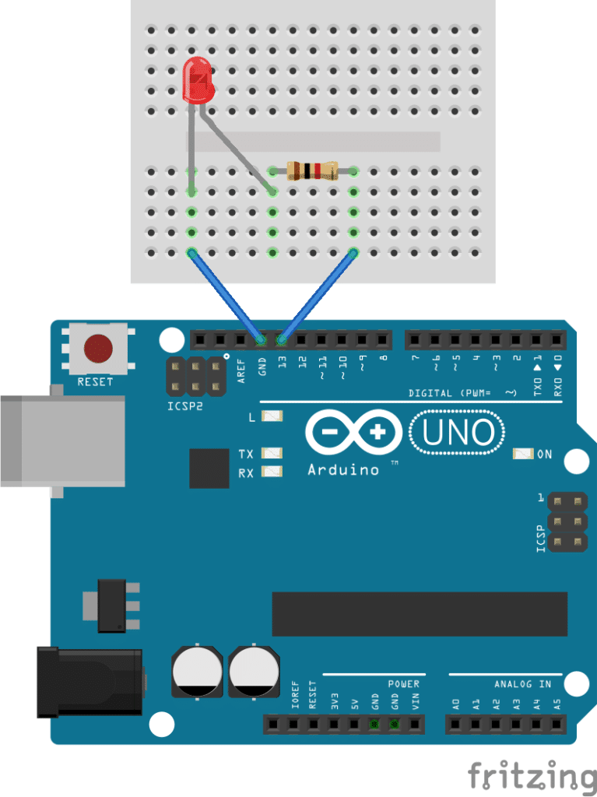
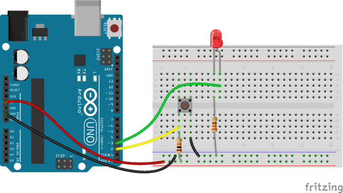
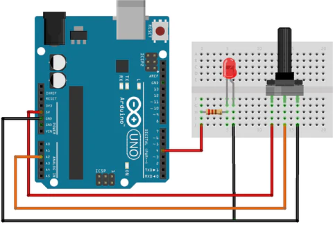

# Arduinos de mi ❤️‍🔥

## LED

Materiales:

- 1 LED
- 1 resistencia de 220 Ohm.



```cpp
int pinLed = 13;

void setup() {
  pinMode(pinLed, OUTPUT);
}

void loop() {
  digitalWrite(pinLed, HIGH);
  delay(1000);
  digitalWrite(pinLed, LOW);
  delay(1000);
}
```

## LED + Botón

Materiales:

- 2 resistencias de 220 Ohm
- 1 LED
- 1 Botón



```cpp
int pinBoton = 2;
int pinLed = 3;
 
void setup() {
  Serial.begin(9600);
  pinMode(pinLed, OUTPUT);
  pinMode(pinBoton, INPUT);
}

void loop() {
  int estadoBoton = digitalRead(pinBoton);
  Serial.println(estadoBoton);

  if (estadoBoton == 1) {
    digitalWrite(pinLed, HIGH);
  } else {
    digitalWrite(pinLed, LOW);
  }

  delay(20);
}
```

## LED + Potenciometro

Materiales:

- 1 Potenciómetro de cualquier resistencia.
- 1 LED
- 1 resistencia de 220 Ohm



```cpp
int pinPot = A0;
int pinLed = 11;
 
void setup() {
  Serial.begin(9600);
  pinMode(pinLed, OUTPUT);
  pinMode(pinPot, INPUT);
}

void loop() {
  int valorPot = analogRead(pinPot);
  int cantidadLuz = map(valorPot, 0, 1023, 0, 255);
  Serial.println(cantidadLuz);
  analogWrite(pinLed, cantidadLuz);

  delay(20);
}
```
